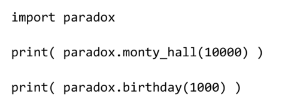

## Практическая работа № 2
### Парадокс дней рождения
В группе, состоящей из 23 или более человек, вероятность совпадения дней рождения
(число и месяц) хотя бы у двух людей превышает 5096. Например, если в классе 23 ученика
или более, то более вероятно то, что у кого-то из одноклассников дни рождения придутся
на один день, чем то, что у каждого будет свой неповторимый день рождения.
Для 60 и более человек вероятность такого совпадения превышает 99%.
Утверждение не является парадоксом в строгом научном смысле: логического
противоречия в нём нет, а парадокс заключается лишь в различиях между интуитивным
восприятием ситуации человеком и результатами математического расчёта.

### Интуитивное восприятие
В группе из 23 человек вероятность совпадения дней рождения у двух человек столь
высока, потому что рассматривается вероятность совпадения дней рождения у любых
двух человек в группе. Эта вероятность определяется количеством пар людей, которые
можно составить из 23 человек. Так как порядок людей в парах не имеет значения, общее
число таких пар равно числу сочетаний из 23 по 2, то есть ( 23 х 22 )/2 = 253 пары.
В формулировке парадокса речь идёт именно о совпадении дней рождения у каких-либо
двух членов группы. Одно из распространённых заблуждений состоит в том, что этот
случай путают с другим случаем, на первый взгляд похожим, когда из группы выбирается
один человек, и оценивается вероятность того, что день рождения каких-либо других
членов группы совпадёт с днём рождения выбранного человека. В последнем случае
вероятность совпадения значительно ниже.

### Задание 1
Утверждение кажется неочевидным, поэтому напишите программу, которая его
подтвердит или опровергнет.
для удобства можно считать, что в каждом месяце 28 дней.

### Задание 2
Оформите код решения парадокса в виде функции birthday(), которая принимает в
качестве параметра количество итераций и возвращает процент в виде числового значения

### Задание З
Оформите код решения предыдущего парадокса (Практикум-1) в виде функции
monty_hall(), которая принимает в качестве параметра количество итераций и возвращает
процент в виде числового значения.
Объедините обе функции в один модуль под именем paradox и используйте как:

